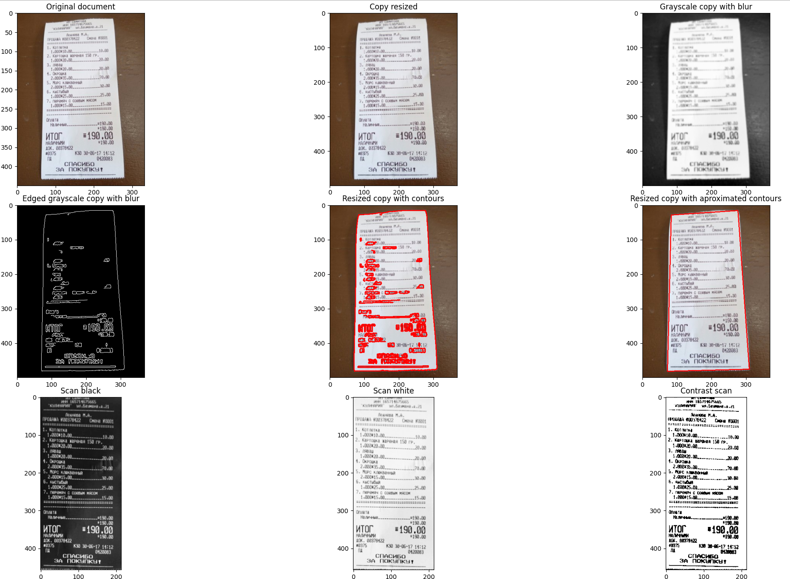

# Репозиторий посвещенный обучению работе с OpenCV, которому я планирую уделять большое количество времени, в том числе выполнить проект.
## FirstProj - простая программа, в которой выполняется захват камеры и вывод букв на изображении
## firstDetection - простая программа, в которой с помощью разных корреляционных алгоритмов выполняется поиск желаемого изображения.


## TrackingObject - программа, написанная с помощью библитек OpenCV, argparse, tkinter, PIL , которая реализует слежение за выбранной областью видео с помощью корреляционных алгоритмов.
## Для запуска программы необходимо:
* Клонировать репозиторий
* Выбрать необходимое видео
* Выполнить команду

```
python3 tracking.py --source /***Путь к вашему видео***  
Если вы хотите выполнить слежение за объектом на видео
```
```
python3 tracking.py 
Если вы хотите выполнить слежение за объектом по камере в реальном времени
```
* На первом кадре выбрать интересующую область, подтвердить выбор в всплывающем окне
<div align="center">

</div>

## SimpleScanner - программа, написанная с помощью библитек OpenCV, argparse, matplotlib, numpy , которая выполняет сканирование документа
## Для запуска программы необходимо:
* Клонировать репозиторий
* Выбрать необходимое видео
* Выполнить команду

```
python3 Scanner.py --source /***Путь к вашему изображению***  
```

* На первом кадре выбрать интересующую область, подтвердить выбор в всплывающем окне
<div align="center">

</div>