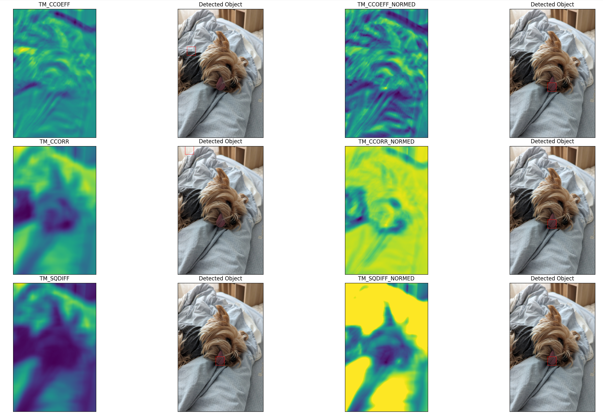

# Репозиторий посвещенный обучению работе с OpenCV, которому я планирую уделять большое количество времени, в том числе выполнить проект.
## FirstProj - простая программа, в которой выполняется захват камеры и вывод букв на изображении
## firstDetection - простая программа, в которой с помощью разных корреляционных алгоритмов выполняется поиск желаемого изображения.


## TrackingObject - программа, написанная с помощью библитек OpenCV, argparse, tkinter, PIL , которая реализует слежение за выбранной областью видео.
## Для запуска программы необходимо:
* Клонировать репозиторий
* Выбрать необходимое видео
* Выполнить команду

```
python3 tracking.py /***Путь к вашему видео*** 
```

* На первом кадре выбрать интересующую область, подтвердить выбор в всплывающем окне

